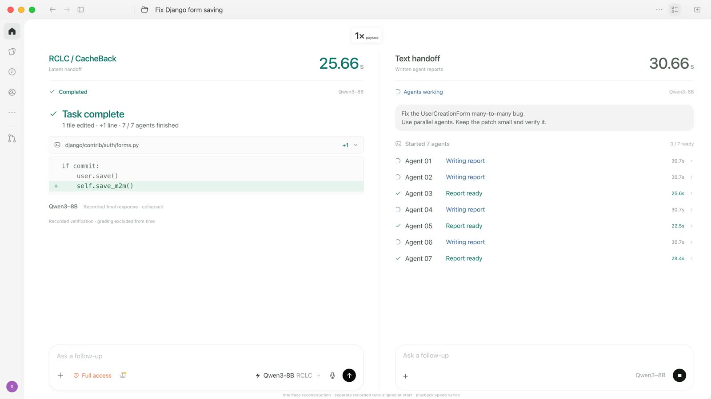

# RCLC

**Receiver-conditioned latent communication for agents.**

Code for *Receiver-Conditioned Latent Communication gives 94% CacheBack*.
**[Website](https://agentcacheback.github.io/)** · **[Paper](https://arxiv.org/abs/2609.32046)** · [Python API](https://github.com/agentcacheback/rclc/blob/main/docs/api.md) · [Paper replication](https://github.com/agentcacheback/rclc/blob/main/docs/replication.md)

Agents distribute large contexts across senders and receivers. Text messages
require decoding and can omit evidence. Full KV-cache messages accumulate every
sender's context at the receiver, increasing memory use and context length.
**Receiver-conditioned communication** lets the receiver state what it needs
in a request. **CacheBack** is a training-free selector that uses attention to
that request to choose which sender positions enter the handoff.


*Highest-accuracy CacheBack setting per family versus same-size text on FanOutQA,
with 50 concurrent tasks on eight H100 GPUs. Operating points differ by family.
Right: the receiver query guides which sender positions enter the handoff.*

## Watch the demo

**[▶ Watch the 36-second coding demo](https://agentcacheback.github.io/#demo)**

[](https://agentcacheback.github.io/#demo)

Seven Qwen3-8B workers help a coordinator fix a Django bug. CacheBack completes
this recorded case in **25.66 s**, versus **113.21 s** for text: **4.41× faster**.
Both produce the same patch and subsequently pass all 88 tests. Startup and
test grading are excluded from the clocks. The silent video reconstructs the
interface from separate runs and varies playback speed. This is one case,
not an aggregate benchmark. [Recorded results](demo/coding/evidence.json).

Also explore the [interactive booking relay](https://agentcacheback.github.io/demo/)
to inspect selected positions and text messages at each handoff. Its
[demo guide](demo/README.md) covers recording your own.

## Install

The distribution is named `rclc`; the Python import is `rcc`. Until the PyPI
release, install from a checkout:

```bash
python -m pip install .
python examples/quickstart.py   # Hugging Face, runs on CPU with Qwen3-0.6B
```

The default GPU runtime is **dense Qwen3 on vLLM 0.11.1**, the paper's Qwen stack.
In a Linux CUDA environment with Python 3.10 or newer:

```bash
python -m pip install -r requirements/vllm.txt
python -m pip install .
```

The engine needs the capture connector; see the
[vLLM setup](https://github.com/agentcacheback/rclc/blob/main/docs/api.md#vllm-default) and
[integration example](https://github.com/agentcacheback/rclc/blob/main/examples/vllm_transfer.py).
vLLM 0.26.0 is an explicit opt-in. Both pins passed a Qwen3-8B GPU journey on an
A100 ([results](https://github.com/agentcacheback/rclc/blob/main/docs/development.md#gpu-validation)).

## Use it

Bind existing Hugging Face Qwen3 agents by their loaded model and tokenizer:

```python
import rcc

agent_x = rcc.bind(model, tokenizer, messages=history_x, backend="hf")
agent_y = rcc.bind(model, tokenizer, messages=history_y, backend="hf")
await rcc.transfer(agent_x, agent_y, "Who owns Cedar?")

inputs = agent_y.pop()
output = model.generate(**inputs, return_dict_in_generate=True)
agent_y.update(inputs=inputs, generation=output)
```

`messages` is each agent's chat history; the request that guides selection goes
in `transfer`. Either agent can send or receive, sharing one model or matching
copies. Transfer never generates an answer. Cross-model alignment is not
supported.

| Supply state with | Use when |
| --- | --- |
| `messages=history` | You have chat messages; RCC applies the chat template. |
| `prompt=text_or_ids` | You have rendered text or exact token IDs. |
| `prompt=ids, past_key_values=cache` | You already have an HF cache. |
| `generation=output` | You have a native HF generation result. |
| `prompt=ids, request_id=capture_id` | You already captured the vLLM prompt. |
| Neither | Receive first, or supply sender state later with `update`. |

- Outside an async function or notebook, use `rcc.transfer_sync(...)` with the
  same options. Native generation and `update` block; finish each operation
  before reusing the model
  ([concurrency](https://github.com/agentcacheback/rclc/blob/main/docs/api.md#concurrency)).
- vLLM: `rcc.bind(llm, backend="vllm", messages=history)` with the
  [engine setup](https://github.com/agentcacheback/rclc/blob/main/docs/api.md#vllm-default).
  Local dense Qwen3 weights are required; hosted chat APIs are not supported.
- `await agent_y.append(new_text_or_ids)` adds a tool result without losing
  received state; `await agent_y.inputs()` continues locally; `save`/`load`
  snapshot retained state
  ([continuation and snapshots](https://github.com/agentcacheback/rclc/blob/main/docs/api.md#continue-append-and-resume)).
- `agent_y.inspect()` shows queued handoffs; `record_selection=True` plus
  `agent_y.selection_html()` shows what survived compression
  ([selection inspection](https://github.com/agentcacheback/rclc/blob/main/docs/api.md#inspect-check-and-view-selection)).
- `python -m rcc doctor` (`--backend vllm` for CUDA) or `rcc.check(agent_y)`
  checks setup without running a model or downloading weights.

Examples: [quickstart](https://github.com/agentcacheback/rclc/blob/main/examples/quickstart.py),
[cached conversation](https://github.com/agentcacheback/rclc/blob/main/examples/existing_agents.py),
[Colab GPU notebook](https://github.com/agentcacheback/rclc/blob/main/examples/colab.ipynb).

### Options

```python
from functools import partial

await rcc.transfer(senders, receivers, requests)               # Relative r4 (default)
await rcc.transfer(senders, receivers, requests, ratio=16)     # Keep 1/16 of new positions
await rcc.transfer(senders, receivers, requests, budget=1024)  # Bounded message size
await rcc.transfer(senders, receivers, requests, selector=rcc.selectors.qsnap)
await rcc.transfer(senders, receivers, requests,
                   reasoning=partial(rcc.latent_mass, steps=50), budget=128)
```

Each argument is one item or a list: two senders, two receivers and two requests
produce four deliveries of two messages each. See
[budgets](https://github.com/agentcacheback/rclc/blob/main/docs/api.md#relative-and-bounded-budgets),
[selectors](https://github.com/agentcacheback/rclc/blob/main/docs/selectors.md),
[reasoning](https://github.com/agentcacheback/rclc/blob/main/docs/api.md#reasoning) and
[representations](https://github.com/agentcacheback/rclc/blob/main/docs/api.md#representations).

## Results in the paper

For Qwen 3 8B, the paper reports 55.3% strict accuracy versus 40.7% for same-size
text, a **14.7 percentage-point gain**, and **3.2x lower median task-completion
latency**, while removing 75% of sender positions. At 16x compression, CacheBack
removes approximately **94% of sender positions** while improving accuracy and
latency over same-size text across the tested families and topologies. These are
the paper's benchmark results, not performance claims for this package.

## Bring your own selector or benchmark

Pass any callable as `selector=` and compare it with CacheBack using the
[small evaluation script](https://github.com/agentcacheback/rclc/blob/main/CONTRIBUTING.md#2-run-a-small-comparison).
The paper's **FanOutQA** and **LongBench v2** panels need separate integration.
New benchmarks and negative results are welcome; see
[Contributing](https://github.com/agentcacheback/rclc/blob/main/CONTRIBUTING.md).

## Branches

| Branch | What it provides |
| --- | --- |
| `main` | State-transfer API, Hugging Face/vLLM adapters, examples, development harness |
| `paper` | Four-family runtimes, both benchmarks, twelve experiment configs, pinned serving stacks, data bundles |

The `paper-v1` tag fixes the replication snapshot; see the
[replication guide](https://github.com/agentcacheback/rclc/blob/main/docs/replication.md).
For checks, tests and GPU validation, see the
[development guide](https://github.com/agentcacheback/rclc/blob/main/docs/development.md).

## License and citation

Apache-2.0. Data licenses and replication requirements are documented on the
`paper` branch.

```bibtex
@misc{rossi2026cacheback,
  title  = {Receiver-Conditioned Latent Communication gives 94\% CacheBack},
  author = {Rossi, Maximillian and Raghunath, Prajwal and Xuan, Haoqing and Zhang, Yusen and Wu, Eugene},
  year   = {2026},
  note   = {Preprint}
}
```
