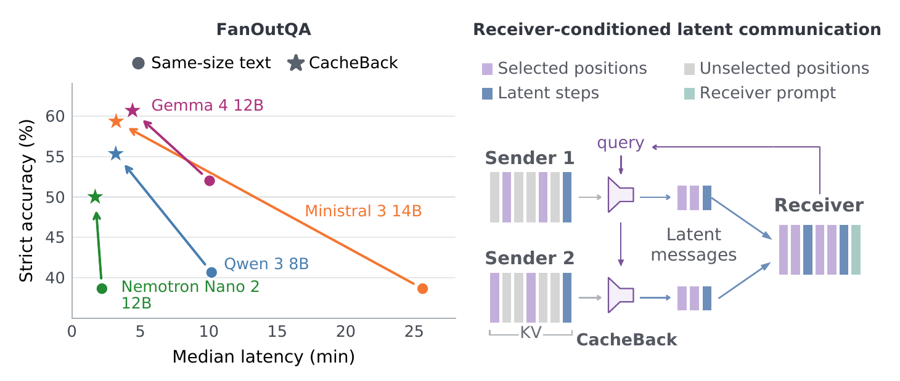

# RCLC: Receiver-Conditioned Latent Communication

Replication code for *Receiver-Conditioned Latent Communication gives 94% CacheBack*.

**Paper link: TBA.** This is the `paper` branch. Use `main` for the Python API.

Agents distribute large contexts across senders and receivers. Text reports
require decoding; full KV-cache messages accumulate every sender's context
at the receiver. **Receiver-conditioned communication** lets the receiver
state its information need as a request. **CacheBack** is a training-free
selector that uses attention to that request to choose which sender positions
enter the handoff.



*Highest-accuracy CacheBack setting per family versus same-size text on FanOutQA,
with 50 concurrent tasks on eight H100 GPUs. Operating points differ by family.
Right: the receiver query guides which sender positions enter the handoff.*

This repository holds the library (cache objects, selectors, latent rollout),
the four model-family runtimes the paper measured (Qwen 3, Gemma 4,
Ministral 3, Nemotron Nano 2), and the two benchmark runners (FanOutQA fan-out,
LongBench v2 chain of agents).

## Install

For the library and the CPU tests:

```bash
python3.10 -m venv .venv && source .venv/bin/activate
pip install -e ".[dev]"
```

The benchmark runners serve through vLLM, and the paper measured two stacks
that cannot share one environment. Make a separate environment per stack,
install its requirements file, then the package without its own pins. For
Qwen 3:

```bash
python3.10 -m venv .venv-qwen3 && source .venv-qwen3/bin/activate
pip install -r requirements/qwen3.txt
pip install -e . --no-deps
```

For Gemma 4, Ministral 3, and Nemotron Nano 2:

```bash
python3.10 -m venv .venv-serving && source .venv-serving/bin/activate
pip install -r requirements/gemma4-ministral3-nemotron2.txt
pip install -e . --no-deps
```

The second stack compiles FlashInfer's sampling kernels at first use, so the
node needs a C++ toolchain and the CUDA 13 toolkit beside the driver: on
Ubuntu, `apt install build-essential ninja-build python3-dev`, then
`export CUDA_HOME=/usr/local/cuda-13.0` with `$CUDA_HOME/bin` on the path.
The CUDA 13 wheels require an NVIDIA driver of version 580 or newer.
Each family's registration module under `src/rcc/models/<family>/` pins the
versions it was measured with, and every engine refuses any other vLLM.
Gemma 4 and Ministral 3 are gated on Hugging Face: accept their terms and log
in with `huggingface-cli login` before a run. The entry downloads every
pinned checkpoint of the family, and Nemotron's prebuilt kernels, once before
the seats open their engines.

## Illustrative query-attention selection example

This example assumes a loaded model, a prefilled `KVCache`, and tokenized
inputs. It illustrates query-attention selection without CacheBack's support
correction. Use the benchmark commands below to run the paper configurations.

```python
from rcc import KVCache, Select, handoff, snapkv_query_scores, span_schedule

# One worker's prefilled cache over its context, and the receiver's query.
cache: KVCache = ...
scores = snapkv_query_scores(model, context_ids, prompt_ids, question_ids)
keep = Select(scores, ratio=4, schedule=span_schedule(16))   # one row in four, 16-token spans
answer_ids = handoff(keep(cache), model, query_ids, max_new_tokens=64)
```

CacheBack itself is `rcc.transforms.select.query_support`: capture the
receiver-query attention over the worker cache, reduce it with the registered
support correction (p=2, alpha=2) on 16-token spans, and keep the top spans
under the budget. The baselines it is compared against (H2O, StreamingLLM,
ChunkKV, KVzip) live beside it under `baselines/`, SnapKV in `scorers.py`, and
mean query attention, CacheBack without the support correction, inside
`query_support/`.

## Run a benchmark

Each run is one config under `configs/` and one sealed source bundle. The
bundles are zstd-compressed tar archives, so `tar` and `zstd` must be on the
path.

```bash
# FanOutQA, natural 50-question panel, Qwen 3 8B receiver, eleven arms
python -m rcc.data fetch fanoutqa-natural-dev50          # 37 MB archive, verified by hash
python -m rcc.run.entry --config configs/qwen-fanoutqa-natural-dev50.toml \
    --bundle data/fanoutqa-natural-dev50
```

The entry resolves the config into a plan, prepares the panel with the
family's tokenizer, writes the registered eight-GPU placement table, runs
every arm through the split-fleet driver (one process per GPU seat), and
publishes `report.json` under `runs/`. One node with eight 80 GB H100s is the
hardware every config is registered against; `--arm` restricts a run to named
arms (`docs/running.md` says how each family names them).
`python -m rcc.run.cli` reads a finished run back: `rescore-results` re-derives
every banked score from raw tokens, `score-results` scores the answers under
the original or the audited references, and `handoff-recall` measures
reference coverage at the handoff (`docs/running.md`).

Both the natural FanOutQA archive and the selector-development archive ship
under `data/` on this branch. `fetch` verifies their pinned digests and
unpacks them offline. Model weights and the LongBench dataset download
separately.

LongBench v2 needs no shipped data. The build CLI fetches the pinned dataset
revision and builds the bundle; the entry prepares the panel from it.

```bash
# LongBench v2, four-hop chain, Qwen 3 8B, per-handoff ladder
python -m rcc.benchmarks.longbench_v2.build_cli fetch-raw \
    --profile longbench-v2-coa-easy50-rerank-sealed --root data/longbench
python -m rcc.benchmarks.longbench_v2.build_cli build-bundle \
    --profile longbench-v2-coa-easy50-rerank-sealed \
    --raw data/longbench/source_cache/data.json --bundle data/longbench-easy50
python -m rcc.run.entry --config configs/qwen-longbench-coa-easy50-rerank-n50.toml \
    --bundle data/longbench-easy50
```

The `--profile` is the config's `benchmark` key; the six chain profiles share
the fifty items, so one bundle serves them all.

## What is in the tree

| path | what it is |
| --- | --- |
| `src/rcc/cache.py`, `transform.py`, `pipeline.py`, `meters.py`, `rope.py` | the engine-free core: the five-axis KV cache, the transform interface, composition, and byte and position meters |
| `src/rcc/transforms/select/` | CacheBack (`query_support/`), the baselines, span schedules, scorers |
| `src/rcc/latent/` | the latent rollout and the cache geometry every family shares |
| `src/rcc/benchmarks/` | the FanOutQA and LongBench v2 panels, prompts, scoring, and build tools |
| `src/rcc/models/` | one runtime per family: engine, capture, selection, receiver, text senders |
| `src/rcc/run/` | the single-node runner: plan resolution, the split-fleet driver, banks, reports |
| `configs/` | the twelve configs behind the paper's tables |
| `experiments/` | the selector-development recall and alignment analysis |

## Tests

```bash
pytest                     # about four hundred CPU tests, a few minutes
pytest tests/test_entry.py # the one-command path end to end on CPU
```

The suite needs no GPU, no model weights, and no network. One file per
surface: the core, the selectors, the two benchmarks, the four family
runtimes, and the fleet. `tests/test_entry.py` drives `rcc.run.entry` from a
config file to a rescored `report.json` over a one-question bundle written
under a temporary directory, with the vLLM engine and the tokenizer faked and
the eight seats run as threads; it is the shortest complete example of what a
run does.

## What reproduces, and what does not

Every end-to-end number in the paper comes from one of the twelve configs run
on one node: the FanOutQA and LongBench tables, the latency figures, the
judger-question ablation. The bank formats, the scoring rules
(`fanoutqa-equivalence-v1`), and the fleet clock that gives the latency
figures are all in this tree, and the three read-back commands score a
finished run the way the paper did (`docs/running.md`). Reruns use the same
panel, seeds, and decoding settings, but individual outputs, aggregate scores,
and latency may differ with hardware and serving conditions. The install and
run steps above were followed as written on a fresh Ubuntu 22.04 node with
eight H100s.

The selector-development diagnostic (Section 3.2, Appendix D) ships as a
second bundle: the thirty audited development prompts, the pinned question
index, and the recorded selections and mean-attention scores for the thirteen
questions the paper reports. Its recall table, sensitivity grid, and
evidence-percentile curve regenerate on CPU; re-running the capture needs the
four Qwen 3 checkpoints on H100 or H200 (`docs/selector-dev.md`). The prompts
themselves do not rebuild from source in this tree: they were cut from pinned
Wikipedia revisions by a preparation script that is not shipped.

Not shipped: the scripts that render the paper's figures and tables from the
report files, and end-to-end run outputs. A run ends in `report.json` and the
read-back summaries, not in a plot.

## Citation

```bibtex
@misc{rossi2026cacheback,
  title  = {Receiver-Conditioned Latent Communication gives 94\% CacheBack},
  author = {Rossi, Maximillian and Raghunath, Prajwal and Xuan, Haoqing and Zhang, Yusen and Wu, Eugene},
  year   = {2026},
  note   = {Preprint}
}
```

## License

Apache-2.0. FanOutQA and LongBench v2 are used under their own licenses; the
FanOutQA natural bundle carries Wikipedia text under CC BY-SA 4.0.
