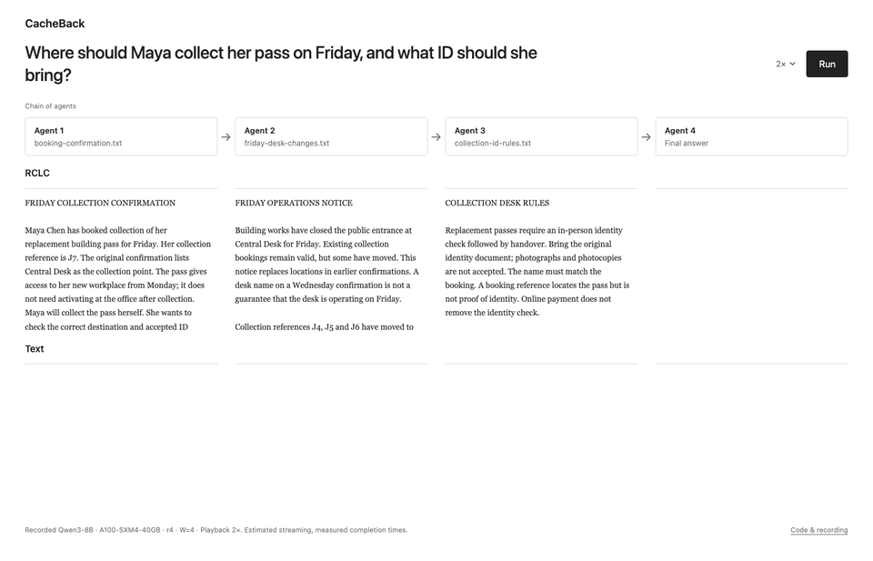

# RCLC

**Receiver-conditioned latent communication for agents.**

Code for *Receiver-Conditioned Latent Communication gives 94% CacheBack*.
**Paper link: TBA.** [Python API](docs/api.md) · [Paper replication](docs/replication.md)

Agents distribute large contexts across senders and receivers. Text messages
require decoding and can omit evidence. Full KV-cache messages accumulate every
sender's context at the receiver, increasing memory use and context length.
**Receiver-conditioned communication** lets the receiver state what it needs
in a request. **CacheBack** is a training-free selector that uses attention to
that request to choose which sender positions enter the handoff.


*Highest-accuracy CacheBack setting per family versus same-size text on FanOutQA,
with 50 concurrent tasks on eight H100 GPUs. Operating points differ by family.
Right: the receiver query guides which sender positions enter the handoff.*

## Watch the handoff

**[▶ Try the demo in your browser](https://maxr0ssi.github.io/rclc/demo/)**



*Replayed at 2× from a recorded Qwen3-8B run on one A100.*

The [interactive demo](demo/README.md) follows a booking, a changed destination
and the new desk's ID rule through four agents. Inspect source-token highlights
alongside the generated text messages as the relay moves left to right, then
compare the final answers and measured latency. The presentation uses W=4.
It replays a real Qwen3-8B recording on an A100, with the full-context answers
and a second question in the raw trace. To run it locally, serve the repo with
`python -m http.server 8765 --bind 127.0.0.1` and open
<http://127.0.0.1:8765/demo/>. Each method replays independently at its recorded
speed, with estimated text streaming. The displayed latencies come from recorded
runs, not a performance benchmark.
An [8B Colab notebook](demo/colab.ipynb) records both widths and saves logs,
traces and a portable replay to Drive; see the [setup steps](demo/README.md#record).

## Use it

One handoff between existing agents:

```python
import rcc

rcc.transfer(sender, receiver, request)
```

`sender` is a view of your agent's existing model state. `receiver` is your
agent's delivery callback, such as `inbox.append`. RCC selects and delivers
state; your receiver continues in its own loop. It does not generate an answer.

Each argument can also be a list:

```python
rcc.transfer(senders, receivers, requests, ratio=4)
```

Every receiver gets every request, packaged with one selected message from
each sender. Two senders, two receivers and two requests produce **four
deliveries, each containing two messages**. Selection is reused across receivers.
Relative compression (`rX`) is the default, starting at `r4`. For a fresh sender,
`ratio=4` keeps one quarter of its positions, rounded up. In a chain, the count
is inherited positions plus one quarter of newly added positions; all positions
are reranked together. Set `SenderState.inherited_positions` to the inherited
prefix length when continuing a chain.

For the paper's bounded (fixed-size) alternative:

```python
rcc.transfer(senders, receivers, requests, budget=1024)
```

This caps each sender's message at 1,024 positions per request, including inherited
state. Choose either `ratio` or `budget`.

CacheBack is the default selector. Supply a function to change how positions are chosen:

```python
rcc.transfer(senders, receivers, requests, selector=my_selector)
```

A selector receives sender state, request IDs and the resolved position budget,
then returns selected indices. The transport validates and packages those rows.
See [the selector contract and package tree](docs/selectors.md).

The default representation is input embeddings. Section 2's alternative is
available explicitly and is **untested in end-to-end GPU runs**:

```python
rcc.transfer(senders, receivers, requests, representation="token_ids+continuous")
```

This sends source token IDs and continuous latent rows, preserving their order.
It requires the matching tokenizer and embedding table at the receiver.

### Optional latent steps

Additional latent generation is off by default (`latent_steps=0`). To generate
from selected context before sending it:

```python
rcc.transfer(senders, receivers, requests, latent_steps=40,
             latent_context="selected_with_request")
```

`"full"` (default) generates from the existing prompt/state before selection;
`"selected"` generates from the selected rows afterward. Use `"full_with_request"`
or `"selected_with_request"` to additionally supply the receiver request during
generation. The prompt may already contain the question. CacheBack separately
uses the request for selection. Transmitted latent rows count inside the budget.
See [latent rollout](docs/api.md#latent-rollout) for budget details and the
receiver-side `rcc.rollout` helper. These options have CPU coverage; live GPU
validation and benchmark comparisons remain outstanding.

### Install and connect your runtime

The default documented runtime is **dense Qwen3 on vLLM 0.11.1**, using the
paper's Qwen stack. In a Linux CUDA environment with Python 3.10 or newer:

```bash
python -m pip install -r requirements/vllm.txt
python -m pip install .
```

The vLLM connector must be enabled when your engine is created. It reads the
agent's existing prompt state; it cannot retrieve state from an ordinary
hosted chat response. Follow the [vLLM setup](docs/api.md#vllm-default) or the
[runnable integration example](examples/vllm_transfer.py).

**vLLM 0.26.0 is unstable, lacks live GPU testing for this public adapter, and
requires explicit opt-in.** Its separate pins and setup are in the API guide.
The paper branch keeps the original 0.26.0 experiments for the other families.

Hugging Face is also supported, including on CPU:

```bash
python -m pip install .
python examples/quickstart.py
```

The quickstart downloads Qwen3-0.6B on first use, then uses the local cache.
It demonstrates handoff and receiver continuation using a small checkpoint.
See the [API guide](docs/api.md) for state binding, receiver continuation,
representation details and limits. Frameworks can supply their own delivery
callback; no LangChain or agent-framework dependency is required.

## Results in the paper

For Qwen 3 8B, the paper reports 55.3% strict accuracy versus 40.7% for same-size
text, a **14.7 percentage-point gain**, and **3.2x lower median task-completion
latency**, while removing 75% of sender positions. Separately, at 16x compression,
CacheBack removes approximately **94% of sender positions** while improving
accuracy and latency over same-size text across the tested families and
topologies. These are benchmark results from the paper, not performance claims
for the public API or its small example.

## Bring your own selector or benchmark

Can your selector preserve more useful evidence at the same communication
budget, or select it faster? Plug it into `rcc.transfer(..., selector=my_selector)`
and compare it with CacheBack on the paper's **FanOutQA** and **LongBench v2**
panels. Have a new task that tests what agents need to communicate? Bring a
benchmark too. We welcome new selectors, benchmarks and reproducible comparisons,
including negative results.

See [Contributing](CONTRIBUTING.md) for the selector contract, benchmark setup
and what to report. Custom selectors work in the API today; running them on the
paper's benchmarks requires integration into an experiment based on `paper`.

## Branches

| Branch | What it provides |
| --- | --- |
| `main` | State-transfer API, Hugging Face/vLLM adapters, examples, development harness |
| `paper` | Four-family runtimes, both benchmarks, twelve experiment configs, pinned serving stacks, data bundles |

The `paper-v1` tag fixes the initial replication snapshot. Follow the
[replication guide](docs/replication.md) to use it.

## Development

```bash
python -m venv .venv
.venv/bin/python -m pip install -e ".[dev]"
scripts/install-hooks.sh
.venv/bin/python scripts/check.py
```

The [main-branch harness](docs/development.md) wires `.codex`, `.claude` and Git
hooks to shared checks. It runs formatting, lint, strict types, source limits,
comment checks and offline CPU tests. GPU examples run separately. The new
public wrapper has CPU checks; a live GPU end-to-end smoke test is still a
release gate, including for the default 0.11.1 adapter.

## License and citation

Apache-2.0. Paper link and final citation: TBA. Data licenses and replication
requirements are documented on the `paper` branch.

```bibtex
@misc{rossi2026cacheback,
  title  = {Receiver-Conditioned Latent Communication gives 94\% CacheBack},
  author = {Rossi, Maximillian and Raghunath, Prajwal and Xuan, Haoqing and Zhang, Yusen and Wu, Eugene},
  year   = {2026},
  note   = {Preprint}
}
```
